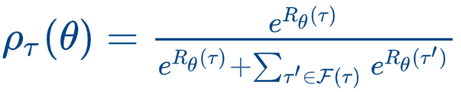

# BO-IRL
[](https://opensource.org/licenses/MIT)


This repository contains the code for the Neurips 2020 paper ["Efficient Exploration of Reward Functions in Inverse Reinforcement Learning via Bayesian Optimization"] (https://arxiv.org/abs/2011.08541). In this work, we propse a novel IRL algorithm called BO-IRL that uses Bayesian Optimzation (BO) to correctly characterize the reward function space.
We introduce a new projection operation called  defined as follows:
<p align="center">
  
</p>

which maps rewards functions to a new space where 1) policy invariant reward functions are mapped to a single point 2) reward functions with similar negative log likelihood (NLL) are mapped close to each other. This is illustrated below:
<p align="center">
  
</p>


## Dependencies
Full dependencies can be found in the "requirements.yml" file. When using Point mass maze and Fetch-Reach environments, you will be required to install the pyMujoco libraries as well.

## Setting up the environment
We will refer to the root directory of this repository as "basedir". 
#### Setting up OpenAI Gym
In our expertiments, we have modified OpenAI Gym to change the Fetch-Reach environment, and add the Point-Mass Maze environment as a standard OpenAI environment. Therefore, you will need to uninstall any standard OpenAI gym present in your python virtual environment (or create a new virtual/conda environment) and install it from our repository. You can follow the steps below:
```
cd gym_boirl
pip install -e .
cd ..
```
You will need to have Mujoco support for Open AI gym. You can follow the instructions from this [page](https://github.com/openai/mujoco-py) on how to setup mujoco for use with OpenAI Gym.

#### For GCL and IRL
We have used the implementation of GCL and AIRL found at this [repository](https://github.com/justinjfu/inverse_rl). Make sure that the necessary prerequisites are satisfied. This repository requires the environment to be an OpenAI Gym. Therefore, we have provided an OpenAI Gym version of Gridworld3d, Virtual Borlange and Real Borlange. To activate them, follow the steps below:

###### For Gridworld3d:
```
cd gym-sigmoid
pip install -e .
cd ..
```
###### For Virtual Borlange:
Open "swedenworld_env.py" inside gym-sweden/gym_sweden/envs in a text editor. Change the variable self.basedir to point to the location of your basedir using it's absolute path. Save the file
```
cd gym-sweden
pip install -e .
cd ..
```
## Usage
Four environments are available in this code (as mentioned in the paper):
 * ```Gridworld```: Synthetic gridworld experiment where the states are represented by the number of gold coins present in them.
 * ```Real Borlange```: Borlange dataset with real world trajectories and no ground truth reward function
 * ```Point Mass Maze```: A modified version of the mujoco environment introduced in [Adversarian IRL (AIRL)](https://arxiv.org/abs/1710.11248)
 * ```Fetch-Reach```: One of the Fetch simulations available in [Open AI](http://gym.openai.com/envs/#robotics)

In addition, we have two more environments that are variants of the Gridworld and Real Borlange environments mentioned above:
 * ```Gridworld2d```: A simplified Gridworld environment where the translation parameter (see paper) is removed.
 * ```Virtual Borlange```: Simulated environment corresponding to the Borlange dataset with an artificial reward function.


While running code, you can refer to these environments using the following ```<envref>```

| **envref**                  | **Environment Name**              |
| --------------------------- | --------------------------------- |
| grdiworld2d                 | Gridworld2d                       |
| grdiworld3d                 | Gridworld                       |
| vborlange                   | Virtual Borlange                  |
| rborlange                   | Real Borlange                     |
| maze                        | Point Mass Maze                   |
| fetch                       | Fetch-Reach                       |


#### Evaluating Existing Results Without Retraining
###### For Table 1:
Table 1 in our paper presents the success rate and number of iterations required for each algorithm to catch up to the expert's ESOR. For instance, our results for Gridworld environment are as follows:
To generate this table from existing results, run the following:
```
sh runTable1.sh
```
This will print the results corresponding to Table 1 (there might be slight differences in the values due to change in expert demonstrations between experiments). It will also plot the ESOR and NLL progress for the algorithms being evaluated and place them on the ```basedir```. For Fetch-Reach environment, the success rate plot is generated instead of ESOR.

#### Training your model
###### Trajectory generation
Before running any IRL algorithms, you need to collect expert trajectories (and other metadata) for the environment of interest. This step needs to be performed only once per environment as the same set of expert trajectories will be reused by all IRL algorithms. To collect expert trajectories on a given environment, run the following by replacing ```<envref>``` with the correct reference to the environment of interest (as mentioned in the table above). **This step is optional since the expert trajectories are provided . Also, this does not apply to Point Mass Maze and Fetch-Reach environments**
**Warning: Do not delete the existing Data folder**
```
python datacollect.py -e <envref>
```
The trajectories will be saved to the ```Data``` folder under the basedir.


###### Run algorithms
The following algorithms are available:

| **algoref**                 | **Algorithm Name**                |
| --------------------------- | --------------------------------- |
| rhorbf                      | BO-IRL with &#961;-RBF            |
| rbf                         | BO-IRL with RBF                   |
| matern                      | BO-IRL with Matern                |
| gcl                         | GCL                               |
| airl                        | AIRL                              |
| birl                        | BIRL                              |

To run any of these algorithms against an environment, run:
```
python runalgorithm.py -e <envref> -a <algoref> -b <budget> -n <number of trials>
```
Once the code is executed, plots of the posterior mean and std can be found in ```<basedir>/ResultDir/<envref>/<algoref>/``` under the names ```PosteriorMean<trial>.png``` and ```PosteriorStd<trial>.png``` respectively.

As shown in the paper (Fig. 5), we can compare the results of the discrete environments, namely Gridworld2d and Virtual Borlange against BIRL. To do so, run the following commands:

- For Gridworld2d:
```
python birl_gridworld.py
```
- For Gridworld3d:
```
python birl_gridworld3d.py
```
- For Virtual Borlange:
```
python birl_vborlange.py
```
The results will be placed in ```<basedir>/ResultDir/<envref>/birl/```. **However, since this evaluation can be time consuming, we have already placed our previous results in the corresponding folders for your inspection without having to run the code.**

###### Calculate ESOR and likelihood
```
python evaluatealgorithm.py -e <envref> -a <algoref>
```
Run this code once for each algorithm that you want to examine.

###### Tabulate ESOR and plot ESOR across iterations
```
python plotalgorithm.py -e <envref> -a <algoref> <algoref> <algoref>..  -p <Percentage of expert's ESOR to match> -n <Number of iterations to plot>
```
When calling this script, you can pass multiple ```<algoref>``` separated by space. ```<Percentage of expert's ESOR to match>``` is a value between 0-1 that represents what percentage of expert's ESOR the algorithm should aim to reach (defaults to 1). ```<Number of iterations to plot>``` is an integer that represents number of iterations to plot ESOR and NLL against.

Results:
* ESOR plot will be saved in ```basedir``` as ```ESOR_<envref>.png```
* NLL plot will be saved in ```basedir``` as ```NLL_<envref>.png```
* Number of iterations for each algorithm (mean and std) to reach the given percentage of Expert's ESOR will be printed in console.

###### Success Rate for Fetch-Reach
Instead of calculating the ESOR for each iteration, we evaluate the performance of BO-IRL in the Fetch-Reach environment using the success rate (SR) metric. Success rate indicates the number of times the robot's gripper touched the target in a given number of episodes. We compare the success rate of the agent trained using the learned reward function using various kernels. AIRL and GCL were not tested due to incompatabilities with the libraries.

The steps involved are identical to the 3 steps mentioned above (```envref``` is set to ```fetch```). However, instead of generating the ESOR plot, a SR plot will be placed in ```basedir``` as ```SR_fetch.png```


### Questions?
For any questions regarding the code or the paper, please email me at [sreejith@comp.nus.nus.edu.sg](mailto:sreejith@comp.nus.edu.sg).


#### Acknowledgements
Parts of the code/network structures in this repository have been adapted from the following repos:

* [justinjfu/inverse_rl](https://github.com/justinjfu/inverse_rl)
* [uidilr/bayesian_irl](https://github.com/uidilr/bayesian_irl)
